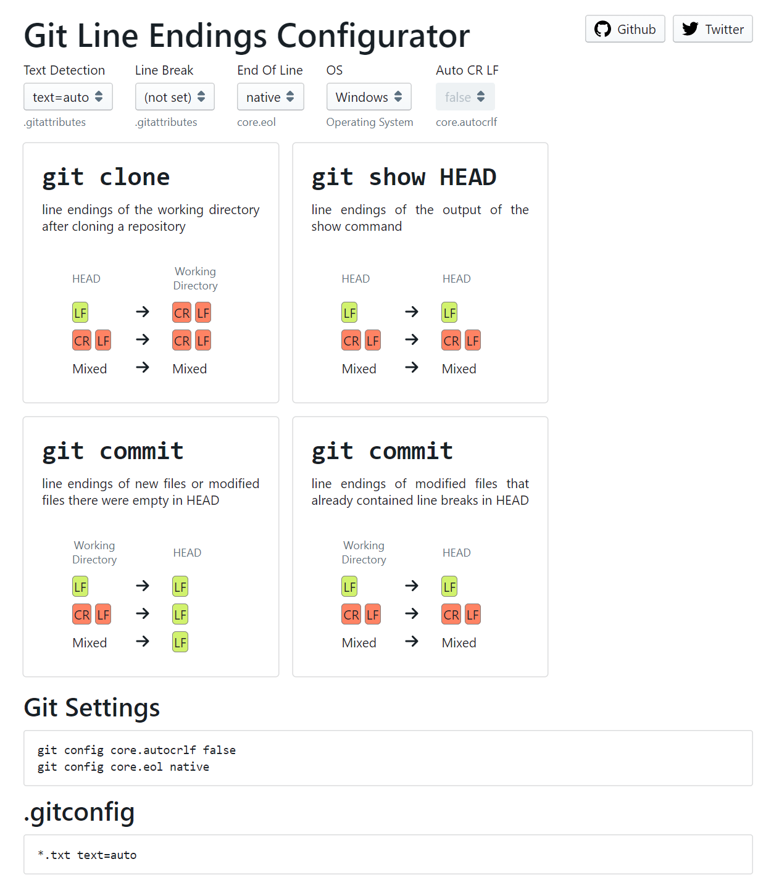

# Git Line Endings Configurator

Screenshot:

## Contributing

`data-retrieval` contains the code for generating the data.
Github Actions are used to run the script on Windows, Mac and Linux.

`web` contains the code for the website.

Feel free to contribute!
